# Implementing Custom k-NN Classifier and Optimization

In this repository, I present a custom implementation of the K-Nearest Neighbors (KNN) algorithm for image classification on the CIFAR-10 dataset. The KNN algorithm is a simple and effective method for classifying data based on the majority class of its nearest neighbors.

## Getting Started

The developed class, named KNN_Classifier, offers a flexible and intuitive approach to understanding the core principles of KNN. The implementation includes features for model fitting, prediction, and distance computation. The report outlines the structure of the custom KNN classifier and provides an example of its usage. Furthermore, the report emphasizes the importance of assessing the performance of the custom implementation using standard classification metrics. While the custom implementation serves as a valuable educational tool, it is acknowledged that, for practical applications, established libraries like scikit-learn with optimized implementations are recommended. The custom KNN implementation serves as an instructive exercise in comprehending the fundamental concepts of the KNN algorithm.

### Pre-Requisites

It would be better to know the background of the k-NN classifier and how it internally works. But even if you do not know, a basic understanding of how a algorithm works and simple math is sufficient to follow up on what is going on.

### Installing and Libraries

If you are using Jupyter and follow meticulous process then follow these process:

1. To check the version: 
```
conda -V
```

2. Creating a virtual environment on Jupyter
Open Anaconda Prompt and type:
```
conda create -n <venv-name> <package-name> anaconda
```
For Example:
```
conda create -n myvenv python==3.10 anaconda
```

3. To activate the virtual environment: 
```
conda activate <venv-name>
```

4. To Install yet another package in virtual environment:
```
conda install -n <venv-name> <package-name>
```
For Example:
```
conda install -n myvenv scikit-learn
```

5. You might want to install the pytorch library for this exercise. Go ahead and install pytorch library:
```
conda install -n myvenv pytorch torchvision -c pytorch
```

6. To deactivate the virtual environment:
```
conda deactivate
```

7. To launch jupyter notebook:
```
jupyter notebook
```

8. To launch jupyter notebook from a specific directory:
```
jupyter notebook --notebook-dir "<directory-path>"
```

### Introduction

The K-Nearest Neighbors (KNN) algorithm is a simple, non-parametric supervised learning technique used widely for classification and regression tasks. Despite its simplicity, KNN can be highly effective for image classification problems if applied carefully.

KNN is considered a "lazy learner" algorithm since it does not explicitly learn or extract distinguishable patterns from the training data points during the training phase. Instead, the training dataset is directly stored, and a prediction is made for any new data point by searching through the entire training set for the K most similar instances (neighbors) based on a distance metric like Euclidean distance. The new data point is then classified by a majority vote of its neighbor's categories.

Applying KNN for image classification tasks involves extracting informative numeric feature representations from image pixels and using those vectors to find nearest image matches from other images with known labels. The key considerations when using KNN for images include:
* Encoding images into consistent and information-rich feature vectors
* Choosing an optimal value for K neighbors
* Selecting a distance metric appropriate for the feature space
* Preprocessing and normalizing image data appropriately

If properly tuned with these factors, KNN can provide highly competitive accuracy on computer vision datasets while having the advantages of simplicity, intuitiveness, and low calculation time for predictions. In this report, a custom KNN classifier for CIFAR-10 image data was implemented and evaluated to demonstrate hands-on understanding.

In this exploration, we embark on understanding the concept behind K-Nearest-Neighbor classification by building our own KNN Classifier from scratch. Our objective is to apply this custom KNN Classifier to the CIFAR-10 dataset. CIFAR-10 is a widely used image classification benchmark dataset in computer vision and machine learning. It consists of 60,000 32x32 color images across 10 different object classes, with 6,000 images per class.

The 10 classes in CIFAR-10 dataset are:
* Airplane
* Automobile
* Bird
* Cat
* Deer
* Dog
* Frog
* Horse
* Ship
* Truck

Each image comes as a pixel array of dimensions 32x32x3 (32 wide, 32 high, 3 color channels R/G/B). The images cover a variety of objects and backgrounds, while including some variations in scale, lighting, angles etc. to add diversity.

The standard split divides CIFAR-10 into 50,000 training images and 10,000 test images. In typical usage, a classifier model is trained on the training split and predictions plus evaluations are done on the held-out test split to provide an unbiased accuracy assessment.

Due to its moderately small size and coverage of real-world objects, CIFAR-10 allows testing machine learning algorithms and techniques on an image recognition task that involves many of the core challenges like background clutter, object appearance variation etc. It serves as a steppingstone towards more complex large-scale datasets like ImageNet.

### Methodology

The concept of finding nearest neighbors may be defined as “the process of finding the closest point to the input point from the given data set”. The algorithm stores all the available cases (test data) and classifies new cases by majority votes of its K neighbors. When implementing KNN, the first step is to transform data points into their mathematical values (vectors). The algorithm works by finding the distance between the mathematical values of these points. It computes the distance between each data point and the test data and then finds the probability of the points being like the test data. Classification is based on which points share the highest probabilities. The distance function can be Euclidean, Minkowski or the Hamming distance.
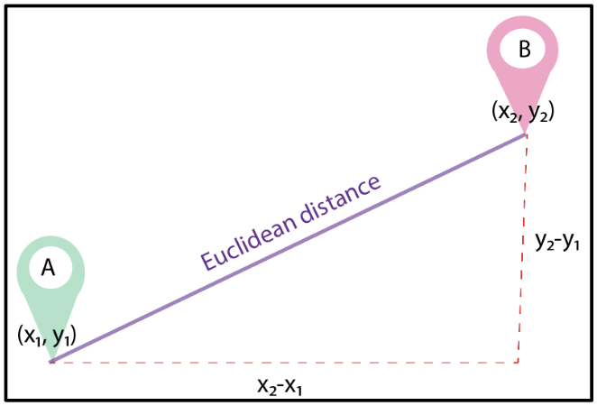

Euclidean distance can simply be defined as the shortest between the 2 points irrespective of the dimensions. The most common way to find the distance between is the Euclidean distance. According to the Euclidean distance formula, the distance between two points in the plane with coordinates (x, y) and (a, b) is given by:
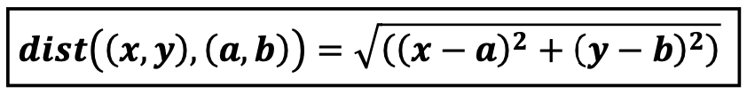

For a given value of K, the algorithm will find the k-nearest neighbors of the data point and then it will assign the class to the data point by having the class which has the highest number of data points out of all classes of the K neighbors.

Let us see the assumption and classification rule of k-NN algorithm:
Assumption: Similar Inputs have similar outputs
Classification rule: For a test input x, assign the most common label amongst its k most similar training inputs.
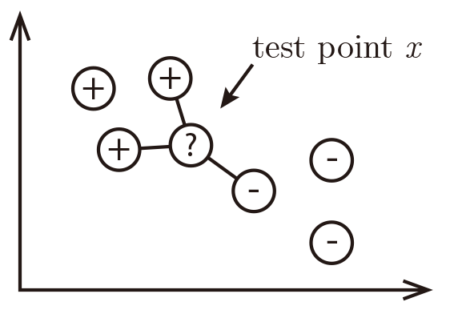

The k-nearest neighbor classifier fundamentally relies on a distance metric. The better that metric reflects label similarity, the better the classified will be. The most common choice is the Minkowski distance.
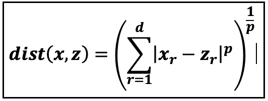

### Bayes optimal classifier
Assume we knew P(y|x). What can we predict provided that y∈{0,1}

### Best Prediction:
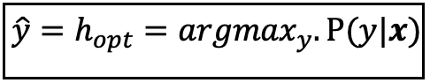

### Error of the BayesOpt classifier:
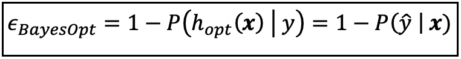

### 1-NN Convergence Proof:
As n → ∞, the 1-NN error is no more than twice the error of the Bayes Optimal classifier.
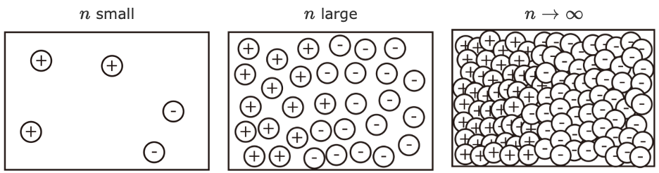

Good news: As n→∞, the 1-NN classifier is only a factor 2 worse than the best possible classifier.
Bad news: We are cursed!!

### Curse of Dimensionality

Imagine X=[0,1]^d, and k = 0, and all training data is sampled uniformly with X, i.e. ∀i,x_i∈ [0,1]^d
Let l be the edge length of the smallest hyper-cube that contains all k-nearest neighbor of a test point. 
Then l^d≈k/n and l≈(k/n)^(1/d)  . 
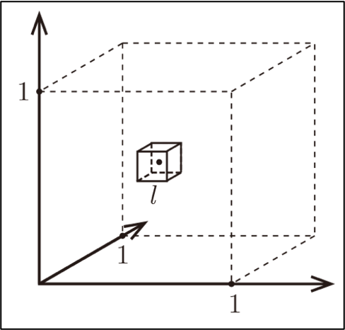

Figure demonstrating `the curse of dimensionality`. The histogram plots show the distributions of all pairwise distances between randomly distributed points within d-dimensional unit squares. As the number of dimensions d grows, all distances concentrate within a very small range.
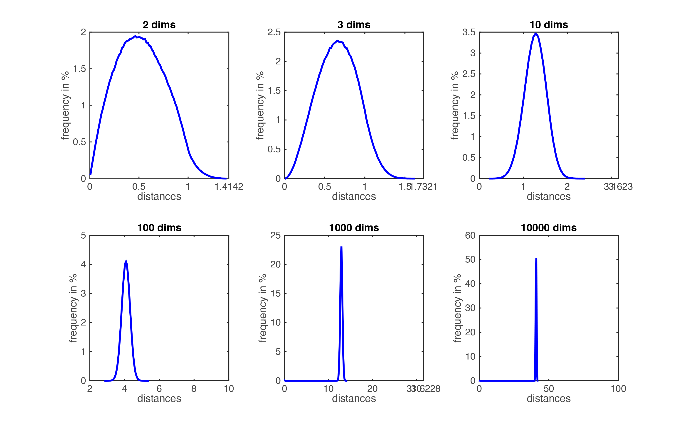

## Custom k-NN Classifier

The custom KNN classifier is implemented in the Python programming language. The class, named KNN_Classifier, is designed to be flexible and easy to use. The key components of the implementation include:
* Initialization: The class is initialized with a parameter k, which represents the number of neighbors to consider during classification. The default value is set to 5, a common choice in practice.
* Model Fitting: The fitModel method is responsible for fitting the model with training data. It takes training features X and corresponding labels y as input and stores them internally.
* Prediction: The predict method is used to make predictions for new data points. Given a set of test points X, it iterates through each test point, computes the distances to all training points, identifies the indices of the k-nearest neighbors, and predicts the label based on the majority class.
* Distance Computation: The compute_distances method calculates the distances between a test point and all training points using the Euclidean distance metric. The cdist function from the scipy.spatial.distance module is utilized for efficiency.
* Performance Analysis: The performance of the custom KNN classifier can be assessed based on metrics such as accuracy, precision, recall, and F1 score. These metrics can be calculated by comparing the predicted labels to the true labels of the test set.
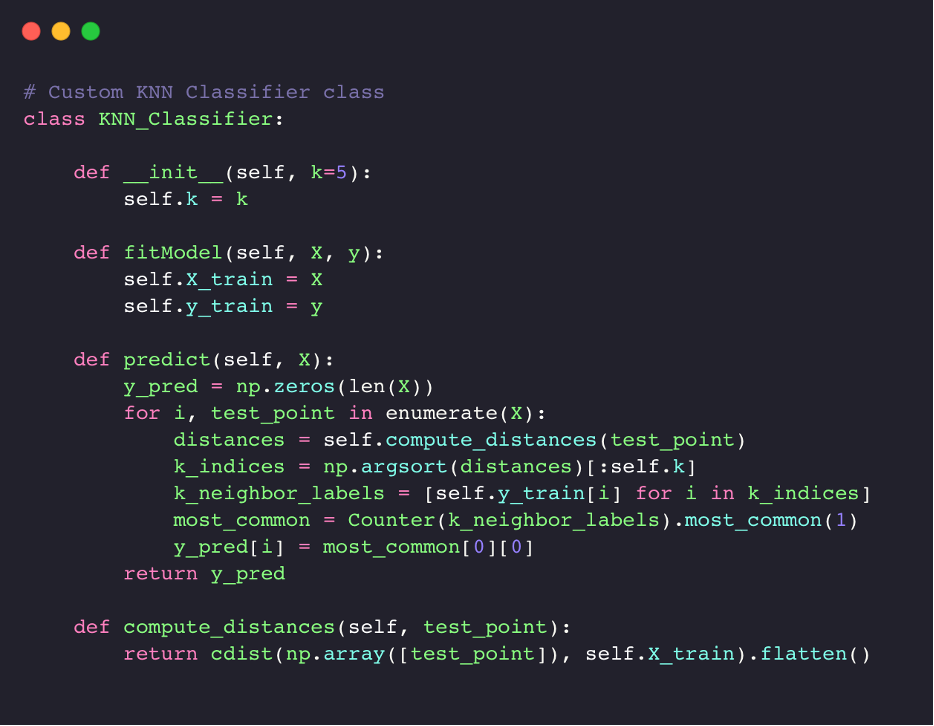

Accuracy:
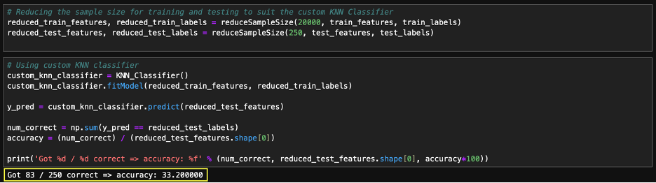

## Optimization of Custom k-NN Classifier

When we must deal with optimizing the custom KNN class, we need to experiment with different aspects of your algorithm. 
* Distance Weights: Introduce distance weights when computing predictions. We can use the inverse of the distances as weights, giving more importance to closer neighbors.
* Use a Different Distance Metric: Experiment with different distance metrics. We might want to try Euclidean distance or Manhattan distance (p=1) or Minkowski distance with different p values.
* Kernel Density Estimation: Implement kernel density estimation for a more robust estimation of the underlying density function.
* Implement Parallelization: Depending on the size of your dataset, you might benefit from parallelizing the distance calculations. This can be achieved using parallel computing libraries such as joblib or concurrent.futures
* Optimize Code for Efficiency: Ensure that your code is optimized for efficiency. Use vectorized operations wherever possible to speed up computations.
* Optimize k Value: Experiment with different values of k to find the one that gives the best performance. You can use techniques like grid search or random search for hyperparameter tuning.

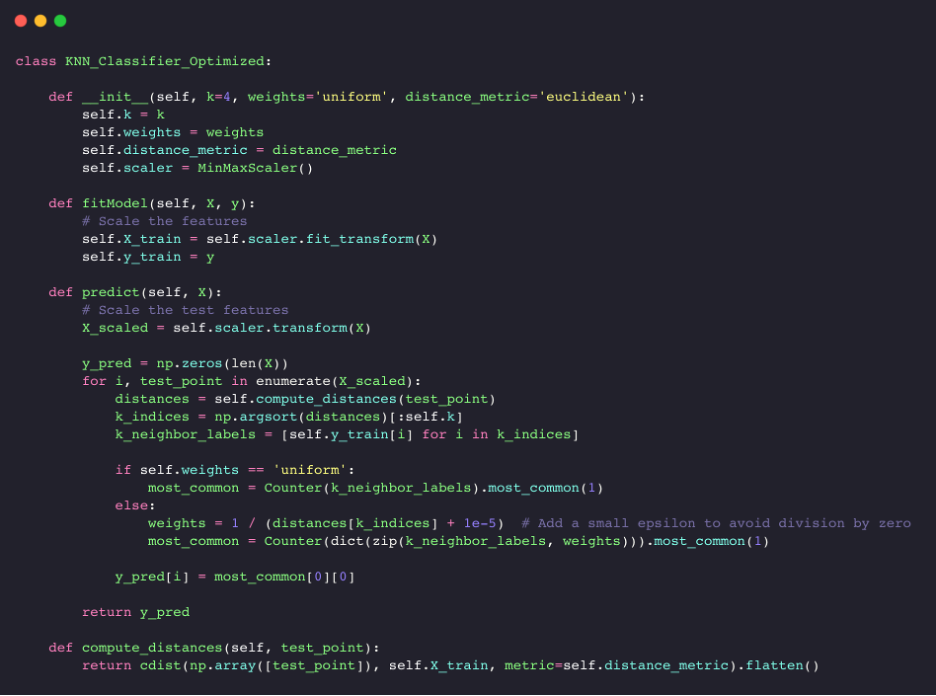

Accuracy:
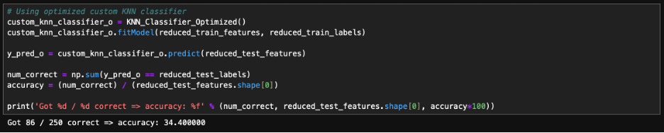

## Summary

k-NN is a simple and effective classifier if distances reliably reflect a semantically meaningful notion of the dissimilarity. (It becomes truly competitive through metric learning). 
* As n → ∞, k-NN becomes provably very accurate, but also very slow. 
* As d → ∞, the curse of dimensionality becomes a concern.
The custom k-NN classifier can be further optimized by using parallelism and other hyper-parameters tuning. There is always scope for improvement. With limited sample re-sizing we have achieved reasonable results.

## References
* Cover, Thomas, and, Hart, Peter. Nearest neighbor pattern classification[J]. Information Theory, IEEE Transactions on, 1967, 13(1): 21-27
* Cornell University lecture: https://www.cs.cornell.edu/courses/cs4780/2017sp/lectures/lecturenote02_kNN.html 
* Math Behind k-NN: https://ai.plainenglish.io/the-math-behind-knn-7883aa8e314c 

## Author
Manoj Chandrashekar
Graduate Student at University of Alabama - Birmingham
Former Lead Data Engineer at 7-Eleven Inc.
LinkedIn: https://www.linkedin.com/in/themanojchandrashekar/ 