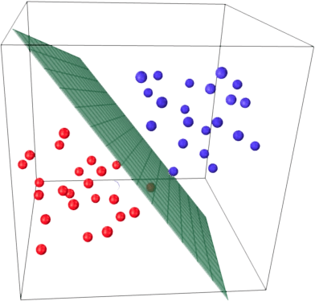
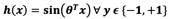
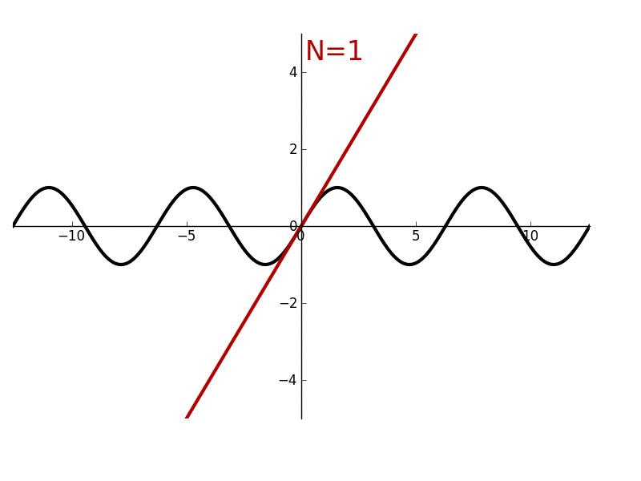

# Impementation of Newton-Raphson Method on Breast Cancer Wisconsin dataset

### Getting Started

In this project, we delve into the realm of logistic regression, a powerful tool for classification tasks, and explore the efficiency and nuances of the Newton-Raphson method. Our dataset of choice is the real-world Breast Cancer Wisconsin dataset, obtained from the UCI machine learning repository. While logistic regression is a convex problem traditionally optimized through gradient descent, the Newton's method, introduced in this project, offers an alternative approach that sidesteps the need for step length tuning.

### Pre-Requisites

The motivation behind employing the Newton's method lies in its ability to harness a quadratic approximation of the objective function, providing an informed trajectory for parameter updates. Through this project, we aim to implement the Newton's method for logistic regression, focusing on minimizing the cross-entropy loss, and apply it to the breast cancer dataset. By doing so, we gain valuable insights into the distinctive characteristics of Newton's method when compared to traditional gradient-based logistic regression.
This mini project serves as an educational journey, unraveling the unique capabilities of Newton's method and shedding light on its utility in specific project requirements and dataset structures. Through a comparative analysis, we uncover where Newton's method shines, enhancing our understanding of the intricate interplay between optimization techniques and real-world data.

### Installing and Libraries

If you are using Jupyter and follow meticulous process then follow these process:

1. To check the version: 
```
conda -V
```

2. Creating a virtual environment on Jupyter
Open Anaconda Prompt and type:
```
conda create -n <venv-name> <package-name> anaconda
```
For Example:
```
conda create -n myvenv python==3.10 anaconda
```

3. To activate the virtual environment: 
```
conda activate <venv-name>
```

4. To Install yet another package in virtual environment:
```
conda install -n <venv-name> <package-name>
```
For Example:
```
conda install -n myvenv scikit-learn
```

5. You might want to install the pytorch library for this exercise. Go ahead and install pytorch library:
```
conda install -n myvenv pytorch torchvision -c pytorch
```

6. To deactivate the virtual environment:
```
conda deactivate
```

7. To launch jupyter notebook:
```
jupyter notebook
```

8. To launch jupyter notebook from a specific directory:
```
jupyter notebook --notebook-dir "<directory-path>"
```

### Introduction

Machine learning is a subfield of artificial intelligence that focuses on the development of algorithms and models that enable computer systems to learn from and make predictions or decisions based on data. The core idea behind machine learning is to enable computers to improve their performance on a specific task through experience, without being explicitly programmed.

In this mini project, we embark on an exploration of logistic regression, a fundamental machine learning technique, by implementing it from scratch with Newton's method. Our objective is to apply this custom logistic regression model to the Wisconsin Diagnostic Breast Cancer (WDBC) dataset obtained from the UCI Machine Learning Repository. The dataset contains valuable information related to the diagnosis of breast cancer, and our aim is to build a classifier that can distinguish between benign and malignant tumors. Through tenfold cross-validation and careful evaluation, we seek to compare the performance of our custom implementation with that of the scikit-learn LogisticRegression model. This project serves as an educational exercise in understanding the intricacies of logistic regression and its practical application in medical diagnostics.

The Wisconsin Diagnostic Breast Cancer (WDBC) dataset is a well-known and extensively studied dataset in the field of machine learning. It was originally created by Dr. William H. Wolberg, W. Nick Street, and Olvi L. Mangasarian, with the intention of developing a predictive model for breast cancer diagnosis.

The dataset contains 569 instances, each with 32 attributes. These attributes encompass various measurements related to cell nuclei characteristics, including radius, texture, perimeter, area, smoothness, compactness, concavity, concave points, symmetry, and fractal dimension. These features are computed from digitized images of fine needle aspirates (FNA) of breast masses. The data also includes a unique ID number for each instance and a diagnosis label indicating whether the tumor is benign (B) or malignant (M).

Past usage of the dataset includes research in nuclear feature extraction for breast tumor diagnosis and the development of machine learning techniques for breast cancer diagnosis and prognosis. The dataset is known to be linearly separable, and it has been used to train models for distinguishing between benign and malignant tumors. The best predictive accuracy achieved was approximately 97.5% using repeated 10-fold cross-validation.

The dataset has been a valuable resource in the development of classification models for breast cancer diagnosis, and it continues to be a relevant topic of research in the medical and machine learning communities.
Overall, the Wisconsin Diagnostic Breast Cancer dataset provides an excellent opportunity for researchers and machine learning practitioners to work on a real-world medical problem, aiding in the early diagnosis and treatment of breast cancer.

Ten real-valued features are computed for each cell nucleus:
* radius (mean of distances from center to points on the perimeter)
* texture (standard deviation of gray-scale values)
* perimeter
* area
* smoothness (local variation in radius lengths)
* compactness (perimeter2 / area - 1.0)
* concavity (severity of concave portions of the contour)
* concave points (number of concave portions of the contour)
* symmetry
* fractal dimension ("coastline approximation" - 1)

The Breast Cancer Wisconsin dataset has the following feature vectors:

| Variable Name      | Role    | Type        | Missing Values |
|--------------------|---------|-------------|----------------| 
| ID                 | ID      | Categorical | no             |
| Diagnosis          | Target  | Categorical | no             |
| radius1            | Feature | Continuous  | no             |
| texture1           | Feature | Continuous  | no             |
| perimeter1         | Feature | Continuous  | no             |
| area1              | Feature | Continuous  | no             |
| smoothness1        | Feature | Continuous  | no             |
| compactness1       | Feature | Continuous  | no             |
| concavity1         | Feature | Continuous  | no             |
| concave_points1    | Feature | Continuous  | no             |
| symmetry1          | Feature | Continuous  | no             |
| fractal_dimension  | Feature | Continuous  | no             |
| radius3            | Feature | Continuous  | no             |
| texture3           | Feature | Continuous  | no             |
| perimeter3         | Feature | Continuous  | no             |
| area3              | Feature | Continuous  | no             |
| smoothness3        | Feature | Continuous  | no             |
| compactness3       | Feature | Continuous  | no             |
| concavity3         | Feature | Continuous  | no             |
| concave_points3    | Feature | Continuous  | no             |
| symmetry3          | Feature | Continuous  | no             |
| fractal_dimension3 | Feature | Continuous  | no             |

### Methodology

Logistic regression is a statistical and machine learning technique used for binary classification, which means it's used to predict one of two possible outcomes. It's widely employed in various fields, including healthcare, finance, marketing, and natural language processing.

Data: Inputs are continuous vectors of length K. Outputs are discrete.




For classification, hyperplanes can also be used. Hyperplanes can indeed be used as linear classifiers in machine learning, and they are a fundamental component of linear classifiers like Support Vector Machines (SVMs) and linear perceptron. Hyperplanes are used to separate data points in feature space, forming decision boundaries that divide one class from another. However, there are some considerations and limitations when using hyperplanes as linear classifiers:

1. *Linear Separability:* Hyperplanes are effective for linearly separable data, where a single straight line or hyperplane can separate the two classes. In cases where the data is not linearly separable, a single hyperplane may not suffice, and more complex decision boundaries are needed.
2. *Limited Expressiveness:* Hyperplanes, by definition, are linear. This means they can only represent linear decision boundaries. For data with non-linear class distributions, a single hyperplane cannot accurately capture the underlying patterns. In such cases, more advanced methods, like kernel SVMs, are necessary.
3. *Sensitivity to Outliers:* Hyperplanes can be sensitive to
outliers. A single data point significantly distant from the others can shift the hyperplane's position, potentially misclassifying other data points. Techniques like soft-margin SVMs address this issue by allowing some misclassifications.
4. *Binary Classification:* Hyperplanes are typically used for binary classification, where there are only two classes. Extending hyperplanes to handle multi-class classification may require more complex strategies, such as one-vs-all or one-vs-one.
5. *Feature Engineering:* The effectiveness of hyperplanes relies on feature engineering. If the input features are not chosen or transformed correctly, linear classifiers, including hyperplanes, may not perform well.
6. *Scalability:* Hyperplanes can become computationally expensive when dealing with high- dimensional data. The dimensionality of the feature space can affect the complexity of finding the optimal hyperplane, and techniques like dimensionality reduction may be required.

Directly modeling the hyperplane would use a decision function.



The output of this function is a sinusoidal wave, which is periodic and bounded between -1 and 1. It maps the input x to a continuous range of values. It maps the input xx to a continuous range of values. The sine function is periodic with a period of 2π, which means it repeats its values every 2π units along the input axis. It's useful for modeling periodic phenomena. The sine function is differentiable everywhere, but its derivative introduces oscillations. This can make it challenging to use in gradient-based optimization methods. The sine function is not commonly used for binary classification problems.


We can use a differentiable function for linear classifier instead.


This function is the sigmoid or logistic function. It maps the input u to a range between 0 and 1. The sigmoid function outputs probabilities and is commonly used in binary classification problems. It is not periodic. It smoothly transitions between 0 and 1 as the input u varies. The sigmoid function is primarily used in machine learning for binary classification. It models the probability that an input belongs to the positive class, making it a key component in logistic regression and artificial neural networks. The sigmoid function is differentiable everywhere, and its derivative is smooth and well-behaved. This makes it suitable for gradient-based optimization and backpropagation in neural networks. It is a fundamental component of logistic regression, which is a widely used technique for binary classification.


The model which we will be choosing is the logistic function applied to the dot product of parameters with input vector. The learning will be finding the parameters that minimize some objective function.


We minimize the negative log conditional likelihood:


The prediction will be the most probable class.


There are many approaches to solve 𝜽∗, and we will be using Newton’s method which uses second derivatives better follow curvature. From linear regression, we know that we can find the minimizer to a quadratic function analytically (i.e. closed form). Yet, gradient descent may take many steps to converge to that optimum.

The motivation behind Newton's method is to use a quadratic approximation of our function to make a good guess where we should step next. Newton’s method uses Taylor series expansion and for an infinitely differentiable function 𝒇(𝒙), 𝒙 𝝐 R, about a point 𝒗 𝝐 R is:


The second order Taylor series approximation cuts off the expansion after the quadratic term:


The Taylor series is closely related to the Hessian matrix and Newton's method, especially when dealing with optimization problems, particularly in the context of finding local minima or maxima of a function.

* The Taylor series expansion is a way to represent a function as a sum of terms, each derived from the function's derivatives at a specific point (typically around a point of interest, often denoted as a). The Taylor series provides an approximation of the function near that point, and the more terms included in the series, the more accurate the approximation.
* The Hessian matrix is a square matrix of second-order partial derivatives of a multivariable function. In the context of Taylor series expansion, the Hessian matrix is used to determine the behavior of the function (e.g., convexity or concavity) around the point of interest a. Specifically, the Hessian matrix can help identify whether the function has a local minimum, local maximum, or saddle point at a.
* Newton's method is an iterative optimization technique used to find the local minimum or maximum of a function. It is particularly effective when dealing with functions that are well- approximated by a quadratic function (a second-degree polynomial), which is where the Taylor series and the Hessian matrix come into play. In each iteration of Newton's method, the algorithm approximates the function using a quadratic model, where the Hessian matrix provides information about the curvature of the function, and the gradient (first-order derivatives) provides information about the slope.
* Convergence: If the Hessian matrix is positive definite (indicating a local minimum) and the initial guess is sufficiently close to the actual minimum, Newton's method converges quickly to the local minimum.



So, how can we approximate a function in K-dimensions?


Maximum Conditional Likelihood Estimation is given by,


Hessian for Logistic Regression:


Comparison with Scikit-learn’s Logistic Regressor:
1. Convergence: Newton's method typically converges faster when the conditions for convergence are met, while scikit-learn's logistic regression may require more iterations, depending on the chosen solver and dataset.
2. Regularization: Scikit-learn provides built-in support for L1 and L2 regularization, making it more versatile for controlling model complexity.
3. Scalability: Newton's method can be computationally expensive for large datasets due to the need to compute and invert the Hessian matrix. Scikit-learn's logistic regression offers more scalable options.
4. Use Cases:
   * Newton's method can be useful for logistic regression in cases where fast convergence and quadratic approximations are desirable, but it may not be suitable for large datasets or when the Hessian matrix is not positive definite.
   * Scikit-learn's logistic regression is a versatile tool for logistic regression in various scenarios, including both small and large datasets, with options for regularization and solver choices.

### Conclusion

In this project, we compared Newton's method and scikit-learn's logistic regression for classifying breast cancer cases. Newton's method demonstrated superior convergence speed, providing efficient real-time diagnostics. Its quadratic model yielded valuable insights, enhancing interpretability. Additionally, its adaptability in regularization settings made it a versatile choice. While scikit-learn's logistic regression remains robust, it exhibited slower convergence in some scenarios. Our findings underscore the significance of selecting the right optimization method for specific applications. The choice between Newton's method and scikit-learn's logistic regression depends on the specific requirements of the task, the nature of the data, and considerations such as convergence behavior, regularization, and scalability. Scikit-learn's logistic regression is a widely used and versatile tool for logistic regression tasks, while Newton's method may be more suitable for certain specialized cases where fast convergence is crucial. Ultimately, Newton's method proved to be the optimal choice for enhancing classification accuracy in our breast cancer diagnosis task.

